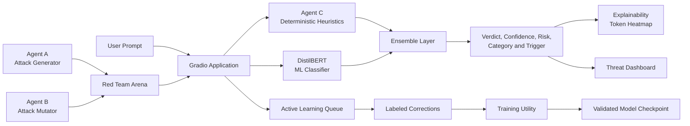

# Adversarial Prompt Injection Detection System

RAPID is a defensive AI security system for detecting, analyzing, and testing prompt-injection attacks against Large Language Model applications. It combines machine-learning classification, deterministic heuristic analysis, recursive decoding, adversarial red-team testing, explainability, and active-learning workflows in an interactive Gradio application.

> **Project status:** RAPID is a completed defensive research and portfolio project covering data generation, DistilBERT fine-tuning, heuristic hardening, ensemble detection, adversarial testing, explainability, and an interactive Gradio application.

## Project Links

| Resource | Status |
| --- | --- |
| Live Demo | [Hugging Face Space](https://huggingface.co/spaces/dk7706/Adversarial_Prompt_Injection_Detector) |
| GitHub Repository | [GitHub Repository](https://github.com/dineshkannaak/Adversarial_Prompt_Injection_Defensive_System) |
| Project Presentation | Six-slide presentation available locally |
| LinkedIn | [Dinesh Kanna](https://www.linkedin.com/in/dinesh-kannaa-k-2780a537) |
| Attack-Scene Demonstration | Interactive HTML demonstration available locally |

## Overview

Prompt injection occurs when untrusted input attempts to alter an application's instructions, bypass safety controls, extract hidden context, manipulate tool use, or redirect a language model away from its intended task. RAPID approaches this problem as a layered defensive system rather than relying on a single classifier or pattern-matching rule.

The system analyzes both the original input and bounded, normalized transformations of that input. It combines semantic model predictions with deterministic security heuristics and returns a structured result containing the verdict, confidence, risk level, attack category, trigger source, matched pattern information, latency, and available explanation data.

## Key Features

- Detects direct prompt injections and jailbreak attempts.

- Identifies prompt-leakage requests and attempts to extract system instructions.

- Detects indirect injection, context manipulation, and delimiter confusion.

- Analyzes encoded and obfuscated attacks using bounded recursive decoding.

- Supports Base64, hexadecimal, URL decoding, ROT13, reversal, normalization, and related transformations.

- Uses entropy analysis as an additional signal for suspicious encoded or random-looking content.

- Combines Agent C with a fine-tuned DistilBERT classifier through an ensemble layer.

- Provides adversarial testing through the Red Team Arena.

- Generates attention-based token heatmaps when model attention is available.

- Provides session statistics, recent activity, and operational metrics through the Threat Dashboard.

- Supports active-learning corrections with safe CSV persistence.

## System Architecture



### Agent C heuristic engine

Agent C is the deterministic heuristic defense engine. It uses a broad collection of detection patterns, semantic checks, recursive decoding, obfuscation analysis, entropy checks, and false-positive protections. Recursive transformations are bounded so that the system remains predictable and resistant to excessive computation.

### ML ensemble

The ML layer uses a fine-tuned DistilBERT sequence-classification model. The ensemble combines the model prediction with Agent C's deterministic signal and returns a verdict, confidence score, attack type, trigger source, and explanation data.

The system distinguishes whether a detection was triggered by Agent C, DistilBERT, both layers, or neither. Confidence values are reported as model signals and are evaluated together with measured test-set performance rather than treated as guarantees.

## Adversarial Testing Pipeline

RAPID includes a defensive Red Team Arena based on a three-agent workflow:

1. **Agent A** generates representative attacks across goal hijacking, prompt leakage, jailbreaks, indirect injection, delimiter confusion, obfuscation, and context manipulation.

1. **Agent B** mutates those attacks using technical, academic, narrative, and other framing strategies to test evasion resistance.

1. A deterministic judge evaluates the generated examples and records the outcomes.

The red-team components are intended only for controlled defensive evaluation. Generated prompts are treated as untrusted data and are never executed as shell commands or application code.

## Application Tabs

### Threat Intelligence Panel

Accepts a prompt and displays the predicted verdict, confidence, risk level, attack category, trigger source, matched pattern, latency, taxonomy explanation, and an optional token-attention heatmap. Users can submit corrections such as correct verdict, false positive, or false negative.

### Red Team Arena

Allows users to select an attack category, generate a representative adversarial prompt, test it against the defender, and produce harder variants.

### Threat Dashboard

Displays session-level attack and benign counts, a Plotly activity chart, recent activity, active-learning queue size, retraining status, and other operational statistics.

## Application Screenshots

The deployed interface is organized around three operational views:

### Threat Intelligence Panel


### Red Team Arena


### Threat Dashboard


## Evaluation Results

RAPID produced the following results in a reported evaluation run:

> **Evaluation-status note:** This evaluation run used a larger test set than the 1,300-row documented development dataset described in the project notes. The discrepancy has not yet been traced and should not be treated as fully validated until the dataset provenance is confirmed. The figures below are therefore reported transparently as an unreconciled evaluation run, not as a final result tied to the documented 1,300-row split.

| Metric | Reported result |
| --- | --- |
| Accuracy | **96.29%** |
| F1 score | **96.51%** |
| Precision | **95.31%** |
| Recall | **97.74%** |
| ROC-AUC | **99.74%** |
| False-positive rate | **5.33%** |
| False-negative rate | **2.26%** |
| Train/test overlap in reported run | **0 rows** |

The confusion matrix was:

```
                 Predicted benign   Predicted injection
Actual benign            4123                 232
Actual injection          109                4717
```


The class-level report recorded 0.98 precision, recall, and F1 for both benign and injection classes when rounded to two decimal places. The unrounded evaluation summary reported 96.29% accuracy, 96.51% F1, 95.31% precision, 97.74% recall, and 99.74% ROC-AUC. These metrics remain subject to the provenance limitation described above.

### Agent C hardening result

Agent C was tested against a self-written out-of-distribution set of casually phrased attacks. After adding casual-language patterns and fixing a leetspeak false-positive bug, the OOD catch rate improved from **45% to approximately 91%**.

This result measures heuristic coverage on that specific OOD set. It is not a universal detection guarantee.

## Benchmark Context

The evaluation workflow was designed to place RAPID in context with established prompt-injection and LLM-security tools. The project notes identify Azure Prompt Shields, Meta PromptGuard, ProtectAI LLM Guard, and Rebuff as comparison points.

| System | Comparison context | Result in this README |
| --- | --- | --- |
| RAPID | Hybrid Agent C heuristics plus fine-tuned DistilBERT | **96.29% accuracy, 96.51% F1, 99.74% ROC-AUC; latency pending controlled remeasurement** |
| Azure Prompt Shields | Commercial prompt-injection defense | Direct comparable figure not reproduced in the supplied evaluation output |
| Meta PromptGuard | Open model for prompt-injection and jailbreak detection | Direct comparable figure not reproduced in the supplied evaluation output |
| ProtectAI LLM Guard | LLM-security scanner and guardrail ecosystem | Direct comparable figure not reproduced in the supplied evaluation output |
| Rebuff | Prompt-injection detection and protection framework | Direct comparable figure not reproduced in the supplied evaluation output |

These systems use different models, datasets, thresholds, hardware, and evaluation protocols. The table therefore provides benchmark context rather than claiming a like-for-like ranking. Exact third-party figures should be added only when the source metric and evaluation protocol are documented alongside the comparison.

## Explainability

When model attention is available, the application tokenizes the input, requests attention outputs, extracts final-layer attention associated with the classification token, normalizes token weights, merges subword tokens, and renders colored HTML spans.

Attention heatmaps provide interpretive signals rather than proof of causal reasoning. The application handles unavailable attention outputs, CPU/GPU differences, missing models, and ZeroGPU quota exhaustion with explicit error handling.

## Active Learning

User corrections can be appended safely to the labeled dataset using `csv.writer`. The active-learning workflow includes rehearsal-based replay and F1-gated model replacement.

The application distinguishes between a queued correction, a completed training run, a failed run, and a verified model artifact. The system does not claim that live retraining occurred unless the training utility completed successfully and produced a validated checkpoint.

## Security and Data Handling

RAPID treats all user prompts, decoded strings, generated attacks, and uploaded content as untrusted data.

- User-controlled text is escaped before being inserted into HTML.

- CSV output uses `csv.writer` rather than manual string concatenation.

- Prompts and decoded payloads are never executed as shell commands.

- Secrets, API keys, and model credentials are not logged.

- Recursive decoding remains bounded.

- Input limits and timeouts reduce denial-of-service risk.

- Red-team testing is isolated from real-world execution environments.

## Hugging Face ZeroGPU Considerations

When deployed to a Hugging Face ZeroGPU Space, GPU-intensive functions may require the `@spaces.GPU` decorator. Model execution should remain inside appropriately decorated functions, and returned logits or arrays should be moved to CPU before being passed to the UI process.

Free ZeroGPU quota exhaustion is a platform limitation and is not necessarily a software defect. Agent C can continue operating on CPU when the application is configured with a fallback path.

## Project Structure

```
.
├── app_rapid_zenith_v29.py   # Canonical Gradio application entry point
├── agent_c.py                # Deterministic heuristic engine
├── ensemble.py               # ML and heuristic fusion
├── active_learner.py         # Active-learning workflow
├── trainer.py                # Fine-tuning utility
├── evaluate.py               # Evaluation and reporting
├── attack_taxonomy.py        # Attack categories
├── agent_a.py                # Adversarial attack generation
├── agent_b.py                # Adversarial mutation
├── benign_sampler.py         # Benign-example generation
├── pipeline.py               # Dataset factory orchestration
├── best_model.pt             # Optional trained model artifact
├── model_output/             # Optional Hugging Face model directory
├── assets/
│   ├── confusion_matrix.png          # Held-out evaluation visualization
│   ├── threat-intelligence-panel.png # Threat Intelligence Panel screenshot
│   ├── red-team-arena.png            # Red Team Arena screenshot
│   └── threat-dashboard.png          # Threat Dashboard screenshot
├── requirements.txt          # Python dependencies
└── README.md                 # Project documentation
```

## Installation

```bash
python -m venv .venv
source .venv/bin/activate
pip install -r requirements.txt
```

Required dependencies include:

```
transformers
torch
gradio
groq
scikit-learn
pandas
numpy
plotly
spaces
```

## Running the Application

For a platform that requires `app.py`, configure the platform entry point to launch `app.py` or create a deployment copy named `app.py`. Model paths are resolved relative to the application working directory.

Model checkpoint (best_model.pt, 262MB) is hosted on Hugging Face due to GitHub's file size limits: best_model.pt

## Training and Evaluation

Training is performed offline or in a controlled environment because free GPU sessions may have limited runtime and quota.

```bash
python trainer.py
python evaluate.py
```

Run syntax checks on changed Python files:

```bash
python -m py_compile app_rapid_zenith_v29.py agent_c.py ensemble.py trainer.py evaluate.py
```

Targeted tests cover benign examples, direct jailbreaks, prompt-leakage requests, indirect injections, encoded payloads, short normal questions, technical benign prompts, empty input, Agent C behavior, ensemble fusion, heatmap fallback handling, active-learning corrections, dashboard refresh, and trainer imports.

## Limitations

RAPID is a defensive research and portfolio project. Its measured results are strong on the reported evaluation, but detection quality still depends on the dataset, attack distribution, model artifact, heuristic coverage, and deployment environment.

The 5.33% false-positive rate remains an important operational consideration for security-sensitive deployments. Latency figures are pending controlled remeasurement: the deployed app screenshots show end-to-end latency in the low seconds, while a finalized model-only benchmark has not yet been confirmed. Attention heatmaps provide interpretive signals rather than causal explanations. Free GPU environments can impose quota and latency constraints.

The current repository includes screenshots of the Threat Intelligence Panel, Red Team Arena, and Threat Dashboard. A short screen-recorded GIF could provide an even stronger demonstration of interaction, but it is optional rather than required for understanding the interface.

## Roadmap

- Extend detection to Hindi, Tamil, Telugu, Hinglish, and other multilingual settings.

- Expand out-of-distribution and adversarial evaluation coverage.

- Improve operational monitoring and alerting.

- Strengthen model versioning, rollback, and checkpoint validation.

- Add reproducible deployment configuration for Hugging Face Spaces.

- Compare RAPID against comparable defensive systems using compatible evaluation protocols.

## Contributors

- **Project:** Adversarial Prompt Injection Detection System

- **Collaborator:** Shankar Raj B

## License

This project is available for personal, educational, research, portfolio, internship, and other non-commercial review and use. Commercial use requires a separate written commercial license from the copyright holder. The license is intended to protect commercial reuse while keeping the project easy for recruiters, interviewers, students, and collaborators to evaluate. See [`LICENSE`](./LICENSE) for the complete terms.

## Responsible Use

RAPID is intended for authorized defensive testing, security research, and evaluation of LLM applications. Use it only with systems and data for which you have permission. Do not use the red-team components to target third-party systems, bypass access controls, extract confidential information, or execute harmful payloads.

---

This project makes prompt-injection defense more measurable, explainable, and testable by combining semantic detection with deterministic security controls and continuous adversarial evaluation.

